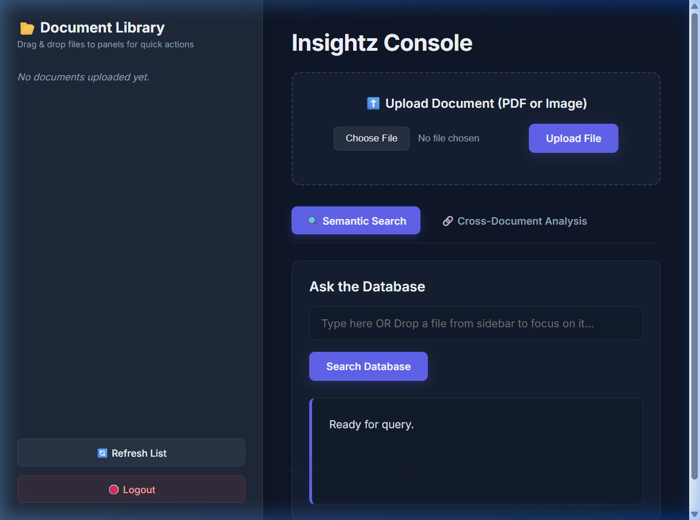
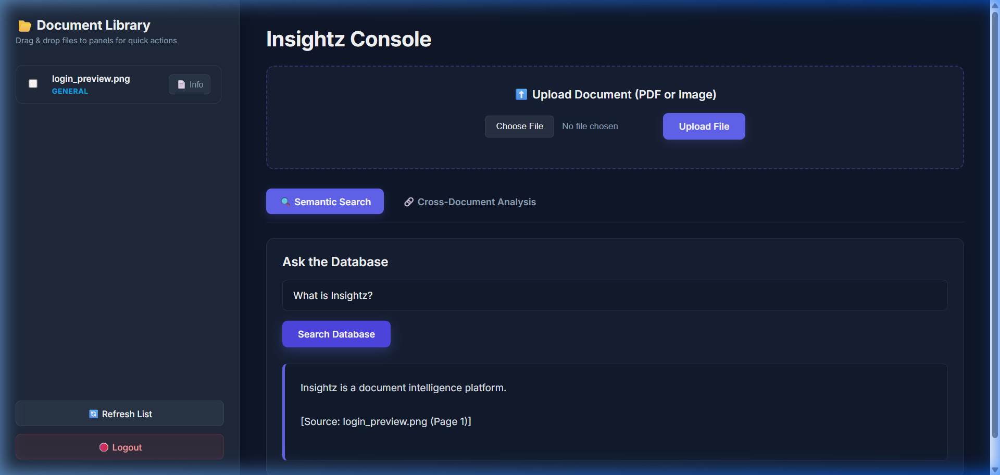
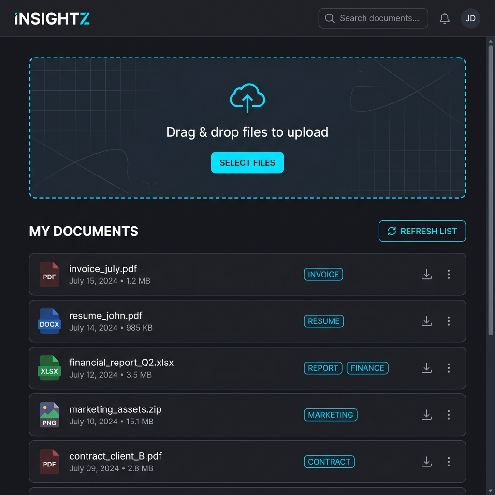

# Insightz: Production-Grade Multi-Tenant RAG Platform

[](https://fastapi.tiangolo.com)
[](https://deepmind.google/technologies/gemini)
[](https://github.com/facebookresearch/faiss)
[](https://langchain.com)
[](#)

Insightz is a high-performance, multi-tenant Retrieval-Augmented Generation (RAG) application. It securely ingests unstructured multi-modal files (PDFs, Images, Notes), performs zero-shot document classification, and provides grounded Q&A capabilities with precise, audit-ready citations.



---

## 🏗️ System Architecture

The system coordinates ingestion and retrieval through a multi-tenant isolation layer, backed by in-memory indexing to minimize latency.

```mermaid
graph TD
    subgraph Ingestion Flow (Write)
        A[User Upload: PDF/Image] --> B[FastAPI Endpoint /upload]
        B --> C{Validation & Guard}
        C -->|Type Allowlist & Max Size| D[Secure Temp File: uuid4]
        D --> E{File Parser}
        E -->|PDF: pdfplumber| F[Page-wise Extraction]
        E -->|Image: Gemini Vision| G[OCR & Transcription]
        F & G --> H[Zero-Shot LLM Classifier]
        H -->|Resume / Invoice / General / Picture| I[Recursive Character Text Splitter]
        I -->|Configurable Chunks| J[Patched Gemini Embeddings]
        J --> K[FAISS Vector DB: Disk]
        K --> L[Atomic Write: doc_store.json]
    end

    subgraph Retrieval Flow (Read)
        M[User Query] --> N[FastAPI Endpoint /search]
        N --> O{In-Memory FAISS Cache}
        O -->|Hit| P[Get Vector Store Object]
        O -->|Miss| Q[Load Local Index from Disk]
        Q --> P
        P --> R[Similarity Search: Top-k Chunks]
        R --> S[Defense-in-depth: Owner Filter]
        S --> T[Grounded Prompt Template]
        T --> U[Gemini-2.5-Flash-Lite LLM]
        U --> V[Citation Parser: Filename + Page]
        V --> W[User Response]
    end
```

---

## ⚡ Key Engineering Highlights

* **True Multi-Tenant Isolation:** Complete storage and query-level segregation. Files are processed with user ownership metadata tags, FAISS indices are partitioned dynamically per-user, and search results undergo a defense-in-depth ownership check to prevent cross-tenant data leakage.
* **In-Memory Index Caching:** Disk read overhead is eliminated for active users. The FAISS vector stores are cached in-memory, dropping query latencies to milliseconds. The cache for a user is automatically invalidated and purged upon a successful document upload.
* **Anti-Hallucination Guardrails:** Generative responses are strictly bound to the retrieved context. The customized LLM prompt enforces a rigorous grounding constraint—if the context cannot answer the query, the model returns a clean `"I cannot find the answer in the provided documents."` instead of hallucinating facts.
* **Audit-Ready citations:** Rather than referencing vague source files, every generated answer includes exact filename and page-level metadata citations (e.g., `Source: Resume.pdf (Page 2)`).
* **Fault-Tolerant & Atomic I/O:** JSON database operations (`users.json`, `doc_store.json`) are completed atomically using `.tmp` files and `os.replace()` to ensure data integrity during server crashes. FAISS index updates are protected against merge failures.
* **Configurable Hyperparameters:** Embedding dimensions and chunk sizes are completely externalized to environment configurations, facilitating immediate iteration on RAG performance.

---

## 🚀 Getting Started

### Prerequisites
* Python 3.10+
* Google Gemini API Key

### Installation

1. **Clone the Repository:**
   ```bash
   git clone https://github.com/vaibhavi466/Insightz.git
   cd Insightz
   ```

2. **Set Up the Virtual Environment:**
   ```bash
   cd backend
   python -m venv venv
   
   # Windows
   .\venv\Scripts\activate
   # macOS / Linux
   source venv/bin/activate
   ```

3. **Install Dependencies:**
   ```bash
   pip install -r requirements.txt
   ```

4. **Configure Environment Variables:**
   Create a `.env` file in the `backend/` directory:
   ```env
   GOOGLE_API_KEY=your_gemini_api_key_here
   JWT_SECRET_KEY=your_secure_jwt_secret_key
   ALLOWED_ORIGINS=http://localhost:5173,http://127.0.0.1:5173
   MAX_UPLOAD_SIZE_MB=20
   EMBEDDING_MODEL=models/gemini-embedding-001
   RAG_CHUNK_SIZE=1500
   RAG_CHUNK_OVERLAP=150
   ```

5. **Start the API Server:**
   ```bash
   uvicorn main:app --reload
   ```

6. **Access the Console:**
   Open **http://127.0.0.1:8000** in your browser. The FastAPI server serves the static Vanilla JS/HTML frontend directly.

---

## ⚙️ Environment Variables

| Variable | Default Value | Description |
|----------|---------------|-------------|
| `GOOGLE_API_KEY` | *(Required)* | The Gemini API authentication key used by LangChain. |
| `JWT_SECRET_KEY` | *(Required)* | Key used to sign JWT session tokens. The application will crash on startup if this is missing. |
| `ALLOWED_ORIGINS` | `http://localhost:5173,http://127.0.0.1:5173` | Comma-separated list of allowed CORS domains. |
| `MAX_UPLOAD_SIZE_MB` | `20` | Max file upload limit enforced at backend stream. |
| `EMBEDDING_MODEL` | `models/gemini-embedding-001` | LLM model identifier for document embeddings. |
| `EMBEDDING_DIMENSIONS` | `768` | Output vector dimensionality for document embeddings. |
| `RAG_CHUNK_SIZE` | `1500` | Size of split text chunks in characters. |
| `RAG_CHUNK_OVERLAP` | `150` | Overlap between adjacent split text chunks. |

---

## 🔗 API Overview

| Method | Endpoint | Auth | Request Body / Parameters | Description |
|--------|----------|------|---------------------------|-------------|
| `POST` | `/signup` | None | `{username, password}` | Registers a new tenant with a hashed password. |
| `POST` | `/login` | None | `{username, password}` | Authenticates and returns a signed 24h JWT token. |
| `POST` | `/upload` | JWT | `file` (Multipart form) | Securely parses, embeds, and indexes a file. |
| `GET` | `/search` | JWT | `query` (Query parameter) | Semantic search query returning grounded answers & citations. |
| `GET` | `/documents` | JWT | None | Lists meta records for files owned by the tenant. |
| `POST` | `/cross-summary` | JWT | `{filenames}` | Synthesizes insights across multiple documents. |

---

## 🗺️ Future Roadmap

* **Persistent SQL Database Integration:** Migrate the local flat-file storage (`users.json`, `doc_store.json`) to SQLite (using `aiosqlite` and `SQLAlchemy`) or add file locks (via the `filelock` package) to prevent concurrent "lost updates" and handle heavy multi-user write traffic safely.
* **Production Managed Vector Store:** Transition from per-tenant FAISS files on disk to a managed vector database (e.g., Qdrant, Milvus, or Pgvector) to scale search capacity.
* **Asynchronous Ingestion Queue:** Offload text chunking and LLM embedding steps to background task workers (e.g., Celery or RQ) to allow large file uploads without blocking request threads.

---

## 📸 UI Previews

### 1. Tenant Authentication Portal


### 2. Semantic Search Console


### 3. Multi-Modal Document Library

